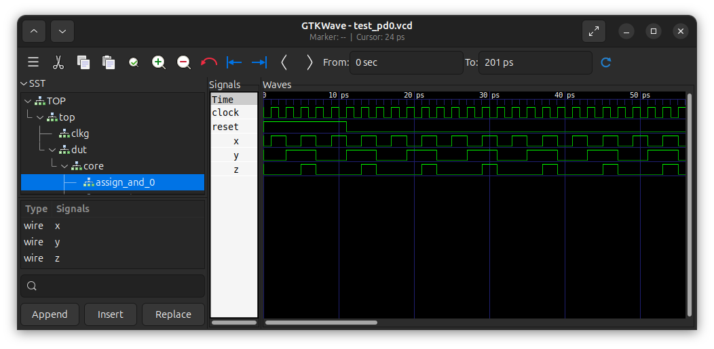
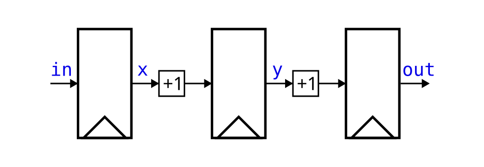

# PD0: Environment Setup and Tutorial

This document guides you through the setup for the environment and the steps for submission.

**Deadline**: Thursday, September 11, 2025 at 11:59 PM

**Weight**: 3% of total lab grade

## Prerequisites

### Option 1
We recommend using one of the following ECE Linux servers, in which all necessary packages and simulators are set up properly for every user.
You should be able to log in using your UWaterloo ID and password.
If you are off-campus, you will need to [set up VPN](https://uwaterloo.atlassian.net/wiki/spaces/ISTSERV/pages/42588307544/About+the+Virtual+Private+Network+VPN) to access the servers.

```bash
ssh -X eceubuntu.uwaterloo.ca
```

If you are using Windows, we recommend installing [MobaXTerm](https://mobaxterm.mobatek.net/) as an SSH client.
If you are using MacOS, you may need to configure [XQuartz](https://www.cyberciti.biz/faq/apple-osx-mountain-lion-mavericks-install-xquartz-server/).

### Option 2

It is possible to install some or all of tools on your local machine.

1. You will need a Linux bash environment to execute the tests. Ubuntu or other Linux distributions should work fine.
2. You will need `make` installed in your distribution to execute the tests.
3. You will need `git` to clone the repository.
4. You will need `verilator` to properly run your code. Refer to Appendix A in the lab manual on [LEARN](https://learn.uwaterloo.ca) for installation guidelines on `verilator`. Make sure that it is present in your `$PATH` environment variable so that it can be detected.

## Paths

Throughout the project, we will frequently refer to files and directories in the repository. All directory and file names are **relative to the repository root**.
For example, the location of this README is `./README.md`.

## Environment Setup

### Getting the repository

If you have not done already, use git to clone the repository to your Linux environment. This can be done using:

```bash
git clone ist-git@git.uwaterloo.ca:ece621-f25/project/v2sharda-pd0.git
```

### Setup of simulators and environment variables

Go to the root of the project repository and execute the command `source env.sh` (use the `-l` flag if running locally).
You should get the information similar to the following.
Note that you will need to perform this operation every time you use a different `bash` session.
Otherwise, the scripts will not be able to locate the files.

```bash
$ source env.sh
===== Computer Architecture Course Environment Setup =====
Important: this script should be used as `source env.sh [-l]` and should only be used in bash
Project Root ($PROJECT_ROOT):		/home/your/path/to/repo
verilator Version ($VERILATOR_VERSION):	 Verilator 4.210 2021-07-07 rev v4.210
Vivado Version ($VIVADO_VERSION): 	 Vivado v2022.1 (64-bit)
===== Computer Architecture Course Environment Done  =====
```

If the script is unable to locate the verilator or vivado version, the corresponding line will be empty.

## Test Run
After setting up the environment, we go through a test run to make sure everything is set up.

Navigate to the `verif/scripts` testing directory with `cd`. Run the following command.

```bash
$ make -s run
Verilator Compilation
Verilator Run
[1] %Error: test_pd0.v:98: Assertion failed in TOP.top.reg_and_arst_test: 
[PD0] Signal(s) for exercise 3.3 is not defined in signals.h
%Error: /home/your/path/to/repo/verif/tests/test_pd0.v:98: Verilog $stop
Aborting...
Aborted (core dumped)
make: *** [Makefile.verilator:37: run] Error 134
```

Since the code for exercise 3.3 and 3.4 is not done, it reports a fatal error that the tests are not successful.
This is expected.
Note the `-s` option of the `make` command that suppresses some console output from showing up.
You may try `make run` to see what is happening.
If you get very noisy results, look for the `[PD0]` prefix in the output.

## Adding code

### Directory Structure

It is not easy to see upfront how the structure of the code works.
However, the structure will remain the same for all PDs.

There are 3 types of file that you will be modifying, where an asterisk (`*`) represents any string:

1. The **Signal Probes** in `design/signals.h`
2. The **Design Files** in `design/code/*.v`
3. The **File List** in `verif/scripts/design.f`

When testing, we compile your **Design Files** defined in the **File List**, then drive and read the **Signal Probes** in our testbench to determine whether 
your implementation is correct.

You should **NOT** modify any other file in the directory.
We will replace these files with the originals when grading.
Any changes you make will not have an effect when submitted.

### Walkthrough

We take the `assign_and` as an example to show you how it is added to the project.
You will need to go through the same process when adding your modules.

#### Step 1. The design
The `assign_and.v` is located at `design/code/assign_and.v`.
It implements an and gate with combinational logic:

```verilog
module assign_and(
  input wire x,
  input wire y,
  output wire z
);
  assign z = x & y;
endmodule // and_assign
```

#### Step 2. Instantiate the design
The module `pd0` located at `design/code/pd0.v` shows how you instantiate the `assign_and` module as a sub-module.

```verilog
module pd0(
  input clock,
  input reset
);
  /* demonstrating the usage of assign_and */
  reg assign_and_x;
  reg assign_and_y;
  wire assign_and_z;
  assign_and assign_and_0 (
    .x(assign_and_x),
    .y(assign_and_y),
    .z(assign_and_z)
  );
  /* other code ... */
endmodule
```

The module `pd0` is your top design. 
You may have as many levels of sub-modules as you want and you will have the freedom to specify their input/output ports.
Your top module, however, must only consists of two input ports `clock` and `reset`, as presented above.

Also notice how the input and output ports of `assign_and_0` are driven by wires and regs.
These are the probes that you provide for us so that we can control the input to your modules freely to test them.
You may also want to write your own testbenches to drive these signals to make sure you submission is correct.

#### Step 3. Edit the Probe File for probes

For each PD, we provide a list of probes that you should provide for us to manipulate your design.

The probe file is located at `design/signals.h`.

```verilog
`define ASSIGN_AND_X  assign_and_x
`define ASSIGN_AND_Y  assign_and_y
`define ASSIGN_AND_Z  assign_and_z
```

A probe is simply a macro definition where the macro names (`ASSIGN_AND_*`) are the names we will be using and the macro values (`assign_and_*`) are the signals within your design.
The macro values normally should be the name of and/or path to a wire or a reg.
The macro values you provide are relative to the top module.

For each PD, we will provide you with a list of probes that you should fill in and a simple test that you should pass so that the type of the probes (wire or reg) should be correct.

#### Step 4. Edit the Probe File for top module name
You will also need to define the `TOP_MODULE` name of your design in the `design/signals.h` so that it can be instantiated properly.

```verilog
/* some other code */

// ----- design -----
`define TOP_MODULE               pd0
// ----- design -----
```

#### Step 5. Edit the File List
You will need to update the design file list at `verif/scripts/design.f`.

Simply include all the files that you use in `design/code`.
Also, DO NOT include more than the code you use as it might cause errors.

#### Step 6. Run the Tests
With the `env.sh` sourced properly, go to `verif/scripts/` and use `make run`.

## Troubleshooting your Design

You may be tempted to rely on `$display()` tasks to debug your design.
However, it can be difficult to determine when signals change value with these statements.
Instead, you can plot the waves using `gtkwave`.
We have provided a Makefile target to do this:

```bash
make waves
```

You can edit `verif/scripts/waves.tcl` to automatically add specific signals to your screen, group signals together, set colours and zoom level, etc.
If you would like to do this Appendix C in the project deliverables document on LEARN.

As an example, we can plot the signals for `assign_and` with `make waves`.
By default, there will not be any signals plotted on the right-hand side.
You can add signals manually by dragging and dropping them from the hierarchy on the left-hand side or by modifying the `verif/scripts/waves.tcl` file.

**NOTE:** The signals will not appear if you have any compilation errors in your Verilog code.
This includes the code you will complete in Exercises 3.3 and 3.4.



## Exercises

If you need to review some basics of Verilog, read through the Verilog Tutorial document on [LEARN](https://learn.uwaterloo.ca).
You will be completing the following exercises based on the document.

### Exercise 3.1

Consider the following code snippet, as shown in the Verilog Tutorial document:

```verilog
always @(posedge clock) begin
    x   <= in;
    y   <= x + 1;
    out <= y + 1;
end
```

Recall that we can draw a block diagram for this snippet as follows:



**Exercises:**

- Using no more than five sentences, explain why the order in which the three non-blocking statements specified within the `always` block is irrelevant.

### Exercise 3.2

Consider the following *different* code snippet:

```verilog
always @(posedge clock) begin
    x   = in;
    y   = x + 1;
    out = y + 1;
end
```

**Exercises:**

- Draw a hardware block diagram to describe the resulting hardware for this code.
- Using no more than five sentences, explain what the hardware does.

### Exercise 3.3

Consider the following Verilog module that implements a registered AND gate:

```verilog
module reg_and(
  input  wire clock,
  input  wire reset,
  input  wire a,
  input  wire b,
  output reg  out
);
    always @(posedge clock)  begin
        if (reset) begin
            out <= 0;
        end else begin
            out <= a & b;
        end
    end
endmodule // reg_and
```

**Exercises:**

- Complete `design/code/reg_and_arst.v` by writing a Verilog specification implementing the registered AND gate *with an asynchronous reset*.
  Ensure that you do not have any simulation errors by following the procedure in the [walkthrough](#walk-through).
- Using no more than five sentences, describe the difference between asynchronous and synchronous resets.

### Exercise 3.4

Consider again the module `reg_and` above.

**Exercises:**

- Complete `design/code/reg_and_reg.v` by writing a Verilog specification implementing the registered AND gate that registers all inputs and outputs of the AND gate and has *a synchronous reset*.
  Note that the output is already registered in the provided example.
  Ensure that you do not have any simulation errors by following the procedure in the [walkthrough](#walk-through).
- Simulate the module and open the waveform with `make waves`.
  Plot the inputs and outputs to the `reg_and_reg` module as well as the clock and reset signal in gtkwave (or any other available software you wish to use).
  Include a screenshot of the plotted signals.
- Using no more than five sentences, explain whether the simulation output is the expected behaviour or not.

## Submission

The following are deliverables for PD0.

1. Complete Exercises 3.3 and 3.4 by filling in the `reg_and_arst` and `reg_and_reg` modules in this repo.
2. Submit your responses to Exercises 3.1 to 3.4 on Learn as a PDF file.

You should see the following output when everything is working correctly:

```bash
$ make -s run
Verilator Compilation
Verilator Run
[PD0] No error encountered
- /home/your/path/to/repo/verif/tests/test_pd0.v:19: Verilog $finish
```

Remember to commit and push your changes to your GitLab repository.
Be sure to execute `git add <PATH(S) TO NEW FILE(S)>` if you add any new files before committing your changes.

```bash
git commit -am "<message>"
git push origin master
```

Your most recently pushed code prior to the deadline will be treated as your submission when we grade.

## Credits


The project structure heavily borrows the AWS EC2 FPGA HDK structure, [see here](https://github.com/aws/aws-fpga).
